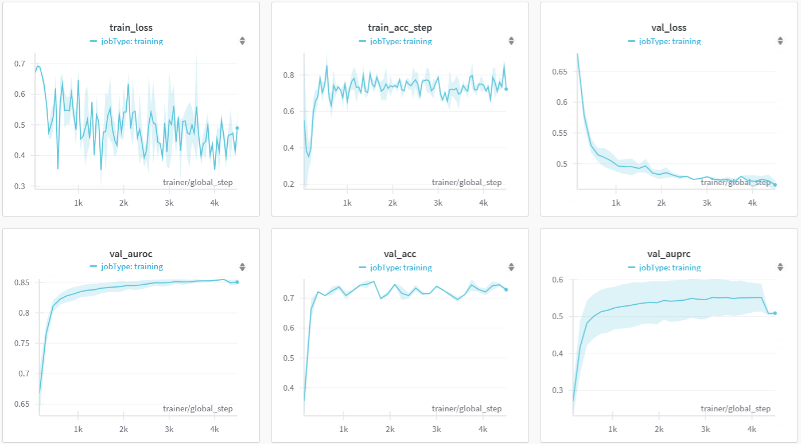
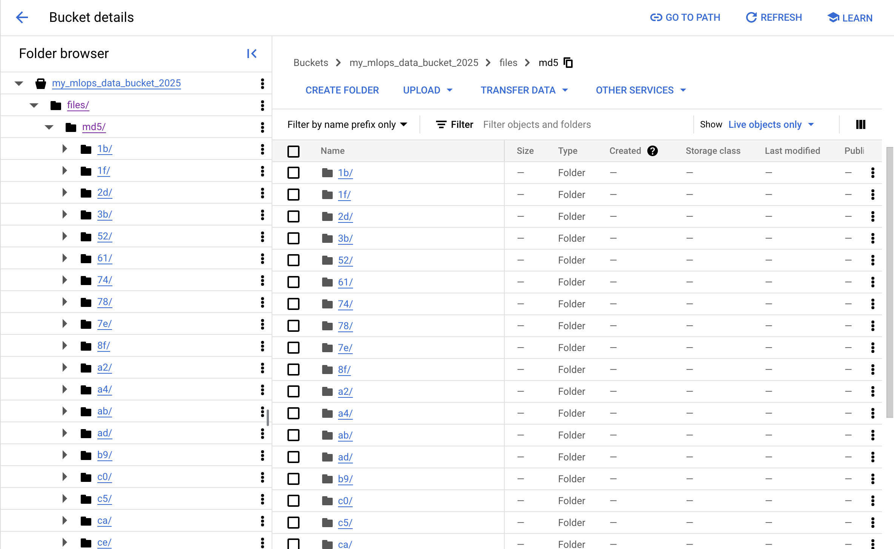
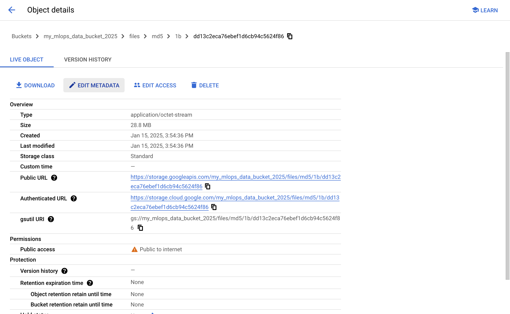
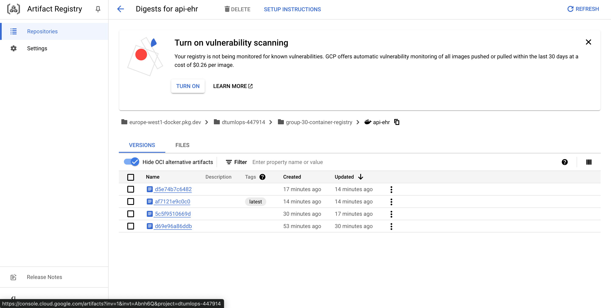
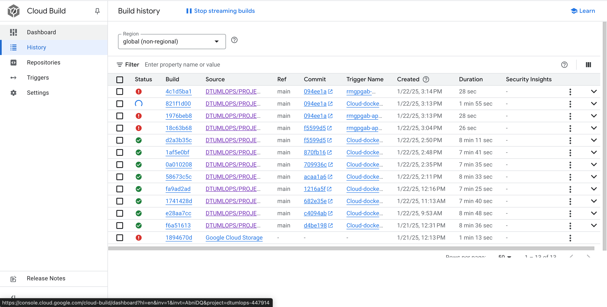
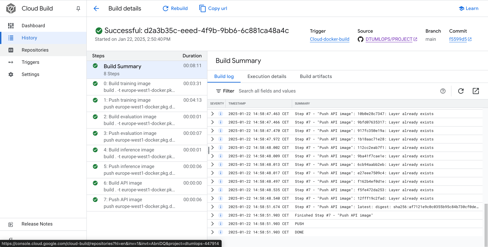
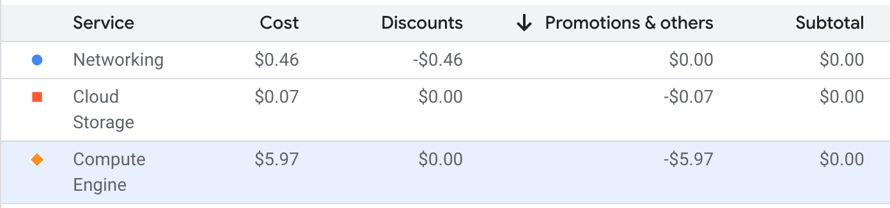

# Exam template for 02476 Machine Learning Operations
This is the report template for the exam. Please only remove the text formatted as with three dashes in front and behind
like:

```--- question 1 fill here ---```

Where you instead should add your answers. Any other changes may have unwanted consequences when your report is
auto-generated at the end of the course. For questions where you are asked to include images, start by adding the image
to the `figures` subfolder (please only use `.png`, `.jpg` or `.jpeg`) and then add the following code in your answer:

```markdown

```

In addition to this markdown file, we also provide the `report.py` script that provides two utility functions:

Running:

```bash
python report.py html
```

Will generate a `.html` page of your report. After the deadline for answering this template, we will auto-scrape
everything in this `reports` folder and then use this utility to generate a `.html` page that will be your serve
as your final hand-in.

Running

```bash
python report.py check
```

Will check your answers in this template against the constraints listed for each question e.g. is your answer too
short, too long, or have you included an image when asked. For both functions to work you mustn't rename anything.
The script has two dependencies that can be installed with

```bash
pip install typer markdown
```

## Overall project checklist

The checklist is *exhaustive* which means that it includes everything that you could do on the project included in the
curriculum in this course. Therefore, we do not expect at all that you have checked all boxes at the end of the project.
The parenthesis at the end indicates what module the bullet point is related to. Please be honest in your answers, we
will check the repositories and the code to verify your answers.

### Week 1

* [x] Create a git repository (M5)
* [x] Make sure that all team members have write access to the GitHub repository (M5)
* [x] Create a dedicated environment for you project to keep track of your packages (M2)
* [x] Create the initial file structure using cookiecutter with an appropriate template (M6)
* [x] Fill out the `data.py` file such that it downloads whatever data you need and preprocesses it (if necessary) (M6)
* [x] Add a model to `model.py` and a training procedure to `train.py` and get that running (M6)
* [x] Remember to fill out the `requirements.txt` and `requirements_dev.txt` file with whatever dependencies that you
    are using (M2+M6)
* [x] Remember to comply with good coding practices (`pep8`) while doing the project (M7)
* [x] Do a bit of code typing and remember to document essential parts of your code (M7)
* [x] Setup version control for your data or part of your data (M8)
* [x] Add command line interfaces and project commands to your code where it makes sense (M9)
* [x] Construct one or multiple docker files for your code (M10)
* [x] Build the docker files locally and make sure they work as intended (M10)
* [x] Write one or multiple configurations files for your experiments (M11)
* [x] Used Hydra to load the configurations and manage your hyperparameters (M11)
* [ ] Use profiling to optimize your code (M12)
* [x] Use logging to log important events in your code (M14)
* [ ] Use Weights & Biases to log training progress and other important metrics/artifacts in your code (M14)
* [ ] Consider running a hyperparameter optimization sweep (M14)
* [x] Use PyTorch-lightning (if applicable) to reduce the amount of boilerplate in your code (M15)

### Week 2

* [x] Write unit tests related to the data part of your code (M16)
* [x] Write unit tests related to model construction and or model training (M16)
* [x] Calculate the code coverage (M16)
* [x] Get some continuous integration running on the GitHub repository (M17)
* [x] Add caching and multi-os/python/pytorch testing to your continuous integration (M17)
* [x] Add a linting step to your continuous integration (M17)
* [x] Add pre-commit hooks to your version control setup (M18)
* [ ] Add a continues workflow that triggers when data changes (M19)
* [ ] Add a continues workflow that triggers when changes to the model registry is made (M19)
* [x] Create a data storage in GCP Bucket for your data and link this with your data version control setup (M21)
* [x] Create a trigger workflow for automatically building your docker images (M21)
* [ ] Get your model training in GCP using either the Engine or Vertex AI (M21)
* [ ] Create a FastAPI application that can do inference using your model (M22)
* [ ] Deploy your model in GCP using either Functions or Run as the backend (M23)
* [ ] Write API tests for your application and setup continues integration for these (M24)
* [ ] Load test your application (M24)
* [ ] Create a more specialized ML-deployment API using either ONNX or BentoML, or both (M25)
* [ ] Create a frontend for your API (M26)

### Week 3

* [ ] Check how robust your model is towards data drifting (M27)
* [ ] Deploy to the cloud a drift detection API (M27)
* [ ] Instrument your API with a couple of system metrics (M28)
* [ ] Setup cloud monitoring of your instrumented application (M28)
* [ ] Create one or more alert systems in GCP to alert you if your app is not behaving correctly (M28)
* [ ] If applicable, optimize the performance of your data loading using distributed data loading (M29)
* [ ] If applicable, optimize the performance of your training pipeline by using distributed training (M30)
* [ ] Play around with quantization, compilation and pruning for you trained models to increase inference speed (M31)

### Extra

* [ ] Write some documentation for your application (M32)
* [ ] Publish the documentation to GitHub Pages (M32)
* [ ] Revisit your initial project description. Did the project turn out as you wanted?
* [ ] Create an architectural diagram over your MLOps pipeline
* [x] Make sure all group members have an understanding about all parts of the project
* [x] Uploaded all your code to GitHub

## Group information

### Question 1
> **Enter the group number you signed up on <learn.inside.dtu.dk>**
>
> Answer:

*30*

### Question 2
> **Enter the study number for each member in the group**
>
> Example:
>
> *sXXXXXX, sXXXXXX, sXXXXXX*
>
> Answer:

*s232946, s233500 ,s234065 ,s233128, s233148*

### Question 3
> **A requirement to the project is that you include a third-party package not covered in the course. What framework**
> **did you choose to work with and did it help you complete the project?**
>
> Recommended answer length: 100-200 words.
>
> Example:
> *We used the third-party framework ... in our project. We used functionality ... and functionality ... from the*
> *package to do ... and ... in our project*.
>
> Answer:

For our project, we chose to work with PyTorch Lightning, a third-party framework that significantly simplified our deep learning implementation. Looking at our code, Lightning helped us in several concrete ways:
Our DSSMLightning class demonstrates how the framework streamlined our development by providing a clean, organized structure where we could focus on the key components of our model. For instance, instead of writing complex training loops, we just defined methods like training_step and validation_step where we specified what should happen in each phase. The framework automatically handled all the training machinery.
The ease with which professional-grade features were implemented, such as metric tracking-we used metrics in-built for accuracy, AUROC, and AUPRC without implementing these calculations ourselves-is a fact. In the code below, one can quickly note how easily we tracked and monitored these metrics during training using the self.log() calls.
The framework saved us significant development time by automatically handling technical aspects like optimizer configuration (configure_optimizers method) and GPU training, allowing us to focus on improving our model's architecture rather than dealing with infrastructure code.
Overall, PyTorch Lightning proved to be an excellent choice as it helped us write more maintainable, professional-grade code while reducing the potential for bugs in the training infrastructure.

## Coding environment

> In the following section we are interested in learning more about you local development environment. This includes
> how you managed dependencies, the structure of your code and how you managed code quality.

### Question 4

> **Explain how you managed dependencies in your project? Explain the process a new team member would have to go**
> **through to get an exact copy of your environment.**
>
> Recommended answer length: 100-200 words
>
> Example:
> *We used ... for managing our dependencies. The list of dependencies was auto-generated using ... . To get a*
> *complete copy of our development environment, one would have to run the following commands*
>
> Answer:

We used pip and pyproject.toml for managing our dependencies. The list of dependencies was auto-generated using pip freeze. To get a complete copy of our development environment, one would have to run the following commands:
pip install invoke
invoke create-environment
conda activate ehr_classification
invoke requirements
invoke dev-requirements

This will set up the environment with all necessary packages including:

Core ML libraries: PyTorch, PyTorch Lightning, torchmetrics
Configuration management: hydra-core, omegaconf
Development tools: pytest, ruff, mypy, pre-commit
Documentation: mkdocs with material theme

### Question 5

> **We expect that you initialized your project using the cookiecutter template. Explain the overall structure of your**
> **code. What did you fill out? Did you deviate from the template in some way?**
>
> Recommended answer length: 100-200 words
>
> Example:
> *From the cookiecutter template we have filled out the ... , ... and ... folder. We have removed the ... folder*
> *because we did not use any ... in our project. We have added an ... folder that contains ... for running our*
> *experiments.*
>
> Answer:

From the cookiecutter template from MLops, we have filled out the repo_name, project_name, author_name, and description fields based on the specifics of our project. Additionally, we configured the python_version to match our project's requirements and selected the appropriate open-source license.

In the resulting structure, we filled out the pyproject.toml file, where we defined the project metadata such as the project name (ehr_classification), version, description, authors, license, and keywords. We also specified the build system requirements and dependencies, linking to requirements.txt and requirements_dev.txt for standard and development dependencies, respectively.

Furthermore, we made adjustments to include tools such as ruff for linting and coverage for test coverage analysis, configuring these in the pyproject.toml file. These modifications ensured the template aligned with our specific project needs and workflow

### Question 6

> **Did you implement any rules for code quality and format? What about typing and documentation? Additionally,**
> **explain with your own words why these concepts matters in larger projects.**
>
> Recommended answer length: 100-200 words.
>
> Example:
> *We used ... for linting and ... for formatting. We also used ... for typing and ... for documentation. These*
> *concepts are important in larger projects because ... . For example, typing ...*
>
> Answer:

Yes, we implemented several measures to ensure code quality and maintainability. All files in the src/ehr_classification folder have type annotations, which make the code more predictable and easier to debug. Following PEP8 standards, we adhered to conventions such as using CapWords for class names and snake_case for methods and variables. Documentation was also a priority. At the beginning of each file, we included a brief description of its purpose, and every class and method has accompanying docstrings. For methods that are particularly complex or critical, we documented their inputs, outputs, simpler methods are described with concise summaries of their functionality.

These practices are very important in larger projects because they keep the codebase clear, organized, and easier to work with. They help the whole team stay on the same page, making it simpler to collaborate and avoid mistakes. Clear typing, consistent formatting, and good documentation save time and reduce confusion, especially when bringing new team members on board. Plus, they make sure the code is easy to update and grow as the project develops.


## Version control

> In the following section we are interested in how version control was used in your project during development to
> corporate and increase the quality of your code.

### Question 7

> **How many tests did you implement and what are they testing in your code?**
>
> Recommended answer length: 50-100 words.
>
> Example:
> *In total we have implemented X tests. Primarily we are testing ... and ... as these the most critical parts of our*
> *application but also ... .*
>
> Answer:

We implemented 35 tests across two main categories: data module and model-related tests.

Dataloader Tests (7):
Validate the DataLoader instance, batch size, shapes of ts_values, static, labels, lengths, and padding for shorter sequences.

Dataset Tests (6):
Ensure dataset length matches batch_size and verify shapes of (ts_values, static, labels, lengths).

Model Tests (22):
Core Model Tests (8): Check forward pass, optimizer configuration, and loss metrics.
Submodule Tests (8): Validate StaticEncoder, StateTransition, and Classifier outputs and error handling.
Edge Case Tests (6): Handle mismatched dimensions, missing class weights, and incorrect inputs.

### Question 8

> **What is the total code coverage (in percentage) of your code? If your code had a code coverage of 100% (or close**
> **to), would you still trust it to be error free? Explain you reasoning.**
>
> Recommended answer length: 100-200 words.
>
> Example:
> *The total code coverage of code is X%, which includes all our source code. We are far from 100% coverage of our **
> *code and even if we were then...*
>
> Answer:

Test Quality Matters: High coverage means most lines are executed, but it doesn't guarantee all edge cases or potential issues are tested.
Unforeseen Scenarios: Real world data or other unknown conditions could lead to bugs not even tested in your tests.
Complex Interactions: Parts of the system may behave differently when integrated, and tests might miss these issues.
Environment Factors: Issues related to external systems or configurations may not show up in unit tests.
In other words, while 94% coverage gives a great deal of confidence, it does not guarantee error-free code. Testing should be continuous and augmented with real-world validation.

### Question 9

> **Did you workflow include using branches and pull requests? If yes, explain how. If not, explain how branches and**
> **pull request can help improve version control.**
>
> Recommended answer length: 100-200 words.
>
> Example:
> *We made use of both branches and PRs in our project. In our group, each member had an branch that they worked on in*
> *addition to the main branch. To merge code we ...*
>
> Answer:

Yes, our workflow included using branches and pull requests. Each team member worked on a specific task or topic in their own branch, and once a task was completed, the code was merged into the main branch through a pull request. This approach helped ensure that changes were introduced systematically and reviewed before being merged. By working on separate branches, we minimized the risk of conflicts and allowed for better version control management. After the initial days of development, direct modifications to the main branch were blocked, ensuring that all changes went through the proper review process via pull requests.

### Question 10

> **Did you use DVC for managing data in your project? If yes, then how did it improve your project to have version**
> **control of your data. If no, explain a case where it would be beneficial to have version control of your data.**
>
> Recommended answer length: 100-200 words.
>
> Example:
> *We did make use of DVC in the following way: ... . In the end it helped us in ... for controlling ... part of our*
> *pipeline*
>
> Answer:

Yes, we used DVC in our project, though it doesn't bring many benefits for versioning control since our data doesn't change in the project. We mostly used it to challenge ourselves to get hands-on experience with DVC. However, it would be a very big help in projects that undergo constant updates of the data or in large datasets to track different versions. In such cases, DVC aids in managing changes in the data, reproducibility, and consistency between different versions of the dataset to make it easier to collaborate and handle large-scale data processing.

### Question 11

> **Discuss you continuous integration setup. What kind of continuous integration are you running (unittesting,**
> **linting, etc.)? Do you test multiple operating systems, Python  version etc. Do you make use of caching? Feel free**
> **to insert a link to one of your GitHub actions workflow.**
>
> Recommended answer length: 200-300 words.
>
> Example:
> *We have organized our continuous integration into 3 separate files: one for doing ..., one for running ... testing*
> *and one for running ... . In particular for our ..., we used ... .An example of a triggered workflow can be seen*
> *here: <weblink>*
>
> Answer:

In our continuous integration setup, we focus on linting and testing to ensure code quality and correctness:

Linting: We use Ruff version 0.9.1 for linting. Ruff is a fast Python linter that checks the code for style violations and potential errors, helping us work within PEP 8 standards and maintain clean, readable code.

Testing is done using the pytest version of 7.4.3, which supports the writing and executing unit tests in the most efficient ways. It ensures detailed reports while checking that any component of code works as anticipated. We measure code coverage for our code base by using the coverage so we can identify how much of it is not appropriately tested.

Multiple Operating Systems: Our CI pipeline is configured to test on multiple operating systems (e.g., Linux, macOS) to ensure cross-platform compatibility. This helps us identify platform-specific issues early in the development process.

By integrating linting, testing, and cross-platform support, we ensure that our code is clean, well-tested, and works seamlessly across different environments.

## Running code and tracking experiments

> In the following section we are interested in learning more about the experimental setup for running your code and
> especially the reproducibility of your experiments.

### Question 12

> **How did you configure experiments? Did you make use of config files? Explain with coding examples of how you would**
> **run a experiment.**
>
> Recommended answer length: 50-100 words.
>
> Example:
> *We used a simple argparser, that worked in the following way: Python  my_script.py --lr 1e-3 --batch_size 25*
>
> Answer:

For configuration management of train.yaml and evaluate.yaml files used for the operation of our experiment, we rely on Hydra for that purpose. YAML files hold information like the path and configuration settings that specify whether the experiment uses a train with a specific configuration for parameters: batch size and learning rate epochs. For example, in order to run the training experiment, we just have to mention a configuration file overriding the parameters through command-line that we need for a particular experiment, batch size, or data split. Using Hydra, several configurations of experiments can be maintained and run rather efficiently, applying all the different settings.

### Question 13

> **Reproducibility of experiments are important. Related to the last question, how did you secure that no information**
> **is lost when running experiments and that your experiments are reproducible?**
>
> Recommended answer length: 100-200 words.
>
> Example:
> *We made use of config files. Whenever an experiment is run the following happens: ... . To reproduce an experiment*
> *one would have to do ...*
>
> Answer:

We used config files for reproducibility and to avoid losing information during experiments. Hydra does this by creating, at the time of running an experiment, a unique directory according to the timestamp and parameters of the experiment-split, batch size, etc.-containing logs, model checkpoints, and outputs. By doing so, all the details of a given experiment, like exact configuration, are stored in the run directory. To reproduce the experiment, a user would simply need to replicate the same configuration file and parameters in order for the environment and settings to exactly match, achieving reproducibility.

### Question 14

> **Upload 1 to 3 screenshots that show the experiments that you have done in W&B (or another experiment tracking**
> **service of your choice). This may include loss graphs, logged images, hyperparameter sweeps etc. You can take**
> **inspiration from [this figure](figures/wandb.png). Explain what metrics you are tracking and why they are**
> **important.**
>
> Recommended answer length: 200-300 words + 1 to 3 screenshots.
>
> Example:
> *As seen in the first image when have tracked ... and ... which both inform us about ... in our experiments.*
> *As seen in the second image we are also tracking ... and ...*
>
> Answer:



In this image we can see various metrics recorded during our training. As we can see, we focus more on the validation metrics, since there we can really see the model evolution. In this particular project, we value differently the true positives and true negatives, so we include metrics as AUROC and AUPRC, besides the usual metrics like loss and accuracy.


### Question 15

> **Docker is an important tool for creating containerized applications. Explain how you used docker in your**
> **experiments/project? Include how you would run your docker images and include a link to one of your docker files.**
>
> Recommended answer length: 100-200 words.
>
> Example:
> *For our project we developed several images: one for training, inference and deployment. For example to run the*
> *training docker image: `docker run trainer:latest lr=1e-3 batch_size=64`. Link to docker file: <weblink>*
>
> Answer:

We applied Docker on the various activities, like training, evaluation, and inference tasks. It gives consistency and reproducibility of any given project with regard to a variety of different environments. It includes train.dockerfile, evaluate.dockerfile, infer.dockerfile where each one depends upon and configured its requirement; Dockerfiles automatically give a built-in option with environment discrepancy consideration while creating separate containers for different activities.

TO run: docker build -t project_name -f train.dockerfile . This ensures that the required directories (data, models, configs) are mounted correctly into the container, and the task runs as expected.

### Question 16

> **When running into bugs while trying to run your experiments, how did you perform debugging? Additionally, did you**
> **try to profile your code or do you think it is already perfect?**
>
> Recommended answer length: 100-200 words.
>
> Example:
> *Debugging method was dependent on group member. Some just used ... and others used ... . We did a single profiling*
> *run of our main code at some point that showed ...*
>
> Answer:

When debugging issues during our experiments, we followed a systematic approach. We utilized version control through GitHub, which allowed us to track code changes and easily identify bugs caused by recent updates. Each team member had write access to ensure collaboration.

Our debugging steps included:

Isolating the issue: Running smaller components of the code (e.g., data processing, model training) to pinpoint where the bug originated.
Logging: We implemented logging to track key events, such as model initialization and error messages, helping us identify issues quickly.
Unit Tests: Writing tests for the data and model code ensured early detection of problems.
Although we didn’t profile the code, these strategies allowed us to efficiently identify and resolve issues, ensuring smooth experiment execution.

## Working in the cloud

> In the following section we would like to know more about your experience when developing in the cloud.

### Question 17

> **List all the GCP services that you made use of in your project and shortly explain what each service does?**
>
> Recommended answer length: 50-200 words.
>
> Example:
> *We used the following two services: Engine and Bucket. Engine is used for... and Bucket is used for...*
>
> Answer:
We used the following services:
- Google Cloud Storage (GCS) to store and manage datasets and model files securely in the appropiate bucket.
- Compute Engine provides virtual machines (VMs) to host and run our application workloads. It is used for deploying and running models, performing batch processing, and serving inference.
- Artifact Registry to store and manage container images and other build artifacts. It helps streamline deployment workflows by hosting Docker images for our machine learning models and applications.
- Secret Manager to store and manage sensitive information, such as the Weigths and Biases API key.


### Question 18

> **The backbone of GCP is the Compute engine. Explained how you made use of this service and what type of VMs**
> **you used?**
>
> Recommended answer length: 100-200 words.
>
> Example:
> *We used the compute engine to run our ... . We used instances with the following hardware: ... and we started the*
> *using a custom container: ...*
>
> Answer:

We used the compute engine to run our training for the model. We used instances with the following hardware: 
e2-medium (2 vCPU, 1 core, 4 GB memory). It worked, but due to the low specs of this VM we ended up training with a member's PC .We are aware that there's GPU accelerated VMs as well, but the costs were too high and threatened to spend all the credits very quickly.

### Question 19

> **Insert 1-2 images of your GCP bucket, such that we can see what data you have stored in it.**
> **You can take inspiration from [this figure](figures/bucket.png).**
>
> Answer:





### Question 20

> **Upload 1-2 images of your GCP artifact registry, such that we can see the different docker images that you have**
> **stored. You can take inspiration from [this figure](figures/registry.png).**
>
> Answer:




### Question 21

> **Upload 1-2 images of your GCP cloud build history, so we can see the history of the images that have been build in**
> **your project. You can take inspiration from [this figure](figures/build.png).**
>
> Answer:





### Question 22

> **Did you manage to train your model in the cloud using either the Engine or Vertex AI? If yes, explain how you did**
> **it. If not, describe why.**
>
> Recommended answer length: 100-200 words.
>
> Example:
> *We managed to train our model in the cloud using the Engine. We did this by ... . The reason we choose the Engine*
> *was because ...*
>
> Answer:

We managed to train the model in the cloud, but, as explained in question 18, due to the low specs of this VM we ended up training with a member's PC .We are aware that there's GPU accelerated VMs as well, but the costs were too high and threatened to spend all the credits very quickly. 

We managed to do it by simply logging into the VM via SSH and using it as we would for any other PC.


## Deployment

### Question 23

> **Did you manage to write an API for your model? If yes, explain how you did it and if you did anything special. If**
> **not, explain how you would do it.**
>
> Recommended answer length: 100-200 words.
>
> Example:
> *We did manage to write an API for our model. We used FastAPI to do this. We did this by ... . We also added ...*
> *to the API to make it more ...*
>
> Answer:

We built an API for our model using FastAPI. The API initializes the model during startup using the lifespan function. This setup includes finding the best model checkpoint with the find_checkpoint utility and loading it into memory using our InferenceEngine.

The main feature of the API is the /predict endpoint. While the current implementation uses random data as input, it’s designed to accept real temporal and static data in JSON format. The inputs are validated using Pydantic models, which also define the structure of the output. The endpoint returns predicted probabilities, predicted classes, and an interpretation of the results.

FastAPI makes the API easy to use, and it generates automatic documentation for testing. We also added error handling to catch issues like the model not being loaded or invalid inputs, ensuring the API is reliable and user-friendly. This setup allows for easy extension and deployment.

### Question 24

> **Did you manage to deploy your API, either in locally or cloud? If not, describe why. If yes, describe how and**
> **preferably how you invoke your deployed service?**
>
> Recommended answer length: 100-200 words.
>
> Example:
> *For deployment we wrapped our model into application using ... . We first tried locally serving the model, which*
> *worked. Afterwards we deployed it in the cloud, using ... . To invoke the service an user would call*
> *`curl -X POST -F "file=@file.json"<weburl>`*
>
> Answer:

--- question 24 fill here ---

### Question 25

> **Did you perform any unit testing and load testing of your API? If yes, explain how you did it and what results for**
> **the load testing did you get. If not, explain how you would do it.**
>
> Recommended answer length: 100-200 words.
>
> Example:
> *For unit testing we used ... and for load testing we used ... . The results of the load testing showed that ...*
> *before the service crashed.*
>
> Answer:

For unit testing, we used pytest to ensure the API's core components were reliable and worked as expected. We tested the model’s forward pass to confirm that outputs had the correct shape and handled edge cases, like mismatched input sizes, without crashing. This helped verify the model’s ability to process both static and temporal data effectively. We also focused on the data loading pipeline, testing the PhysionetDataset and PhysionetDataModule to ensure batches were created correctly, shorter sequences were padded properly, and sequence lengths were accurate. These tests ensured data integrity throughout the training and evaluation processes. Additionally, we validated submodules like encoders and classifiers to confirm they handled edge cases, such as empty inputs or unexpected input sizes. This thorough testing helped us catch potential issues early, ensuring the API is robust and performs well in real-world scenarios.
For unit testing, we used pytest to ensure the API's core components were reliable and worked as expected. We tested the model’s forward pass to confirm that outputs had the correct shape and handled edge cases, like mismatched input sizes, without crashing. This helped verify the model’s ability to process both static and temporal data effectively. We also focused on the data loading pipeline, testing the PhysionetDataset and PhysionetDataModule to ensure batches were created correctly, shorter sequences were padded properly, and sequence lengths were accurate. These tests ensured data integrity throughout the training and evaluation processes. Additionally, we validated submodules like encoders and classifiers to confirm they handled edge cases, such as empty inputs or unexpected input sizes. This thorough testing helped us catch potential issues early, ensuring the API is robust and performs well in real-world scenarios.
### Question 26

> **Did you manage to implement monitoring of your deployed model? If yes, explain how it works. If not, explain how**
> **monitoring would help the longevity of your application.**
>
> Recommended answer length: 100-200 words.
>
> Example:
> *We did not manage to implement monitoring. We would like to have monitoring implemented such that over time we could*
> *measure ... and ... that would inform us about this ... behaviour of our application.*
>
> Answer:

--- question 26 fill here ---

## Overall discussion of project

> In the following section we would like you to think about the general structure of your project.

### Question 27

> **How many credits did you end up using during the project and what service was most expensive? In general what do**
> **you think about working in the cloud?**
>
> Recommended answer length: 100-200 words.
>
> Example:
> *Group member 1 used ..., Group member 2 used ..., in total ... credits was spend during development. The service*
> *costing the most was ... due to ... . Working in the cloud was ...*
>
> Answer:

The most expensive part of the project was the use of the compute engine (for training), this ended up costing us 5.97 dollars. Luckily this cost was covered by DTU. The rest of the costs were negligible, coming out at a total of around 6.50 USD. See the figure below:



The most expensive part of the project was the use of the compute engine (for training), this ended up costing us 5.97 dollars. Luckily this cost was covered by DTU. The rest of the costs were negligible, coming out at a total of around 6.50 USD. See the figure below:


### Question 28

> **Did you implement anything extra in your project that is not covered by other questions? Maybe you implemented**
> **a frontend for your API, use extra version control features, a drift detection service, a kubernetes cluster etc.**
> **If yes, explain what you did and why.**
>
> Recommended answer length: 0-200 words.
>
> Example:
> *We implemented a frontend for our API. We did this because we wanted to show the user ... . The frontend was*
> *implemented using ...*
>
> Answer:

No, we ran into many technical issues while making sure that the code ran on all of our machines. One of the team members had an old macbook that really caused many problems, so in the end we didn't have time to add extra components. However it was a very instructive learning experience, to figure out what we would do if this was to happen in a real life scenario.
No, we ran into many technical issues while making sure that the code ran on all of our machines. One of the team members had an old macbook that really caused many problems, so in the end we didn't have time to add extra components. However it was a very instructive learning experience, to figure out what we would do if this was to happen in a real life scenario.

### Question 29

> **Include a figure that describes the overall architecture of your system and what services that you make use of.**
> **You can take inspiration from [this figure](figures/overview.png). Additionally, in your own words, explain the**
> **overall steps in figure.**
>
> Recommended answer length: 200-400 words
>
> Example:
>
> *The starting point of the diagram is our local setup, where we integrated ... and ... and ... into our code.*
> *Whenever we commit code and push to GitHub, it auto triggers ... and ... . From there the diagram shows ...*
>
> Answer:

### Question 30

> **Discuss the overall struggles of the project. Where did you spend most time and what did you do to overcome these**
> **challenges?**
>
> Recommended answer length: 200-400 words.
>
> Example:
> *The biggest challenges in the project was using ... tool to do ... . The reason for this was ...*
>
> Answer:

Throughout this project, we faced several challenges that taught us a lot and helped improve our approach moving forward.

One of the first difficulties we ran into was with managing dependencies. One team member was working on an older MacBook, and it turned out that the latest version of PyTorch wasn’t compatible with their system. This created some issues when trying to set up the environment. We spent time troubleshooting and eventually resolved it by downgrading to a version of PyTorch that worked better with older systems. This situation made us realize just how important it is to manage dependencies carefully and make sure everyone is working with the right versions, especially when different team members might have different hardware setups. Another challenge came up when we were setting up Docker for local testing. We initially struggled with getting the Docker container to work properly. Specifically, we ran into issues with file paths and environment variables that prevented the container from behaving the same way it did on our local machines. After some trial and error, and looking into things like relative imports and how Docker handles file systems, we were able to get it working. This was a good reminder of how important it is to understand the underlying system when working with containers, and how small mistakes in configuration can have a big impact. Deploying the API to the cloud was another hurdle. We faced an error that said the port couldn’t be found, which was confusing at first. We had to dig deeper into cloud deployment practices and troubleshoot the configuration. We were not able to get it working even when employing the hints from the course module regarding this issue. This experience showed us how important it is to understand the specifics of the environment you're working in. Sometimes things work in one environment, but when you move to the cloud, different rules or configurations can cause unexpected issues. Overall, this project was a valuable learning experience. It taught us a lot about best practices for version control, dependency management, and cloud deployment. Even though the project wasn’t huge, it helped us develop good habits and showed us the importance of staying organized and focused on creating clean, reliable code. Each challenge was a chance to improve our skills and problem-solving abilities, and we’re confident it will help us in future projects.

### Question 31

> **State the individual contributions of each team member. This is required information from DTU, because we need to**
> **make sure all members contributed actively to the project. Additionally, state if/how you have used generative AI**
> **tools in your project.**
>
> Recommended answer length: 50-300 words.
>
> Example:
> *Student sXXXXXX was in charge of developing of setting up the initial cookie cutter project and developing of the*
> *docker containers for training our applications.*
> *Student sXXXXXX was in charge of training our models in the cloud and deploying them afterwards.*
> *All members contributed to code by...*
> *We have used ChatGPT to help debug our code. Additionally, we used GitHub Copilot to help write some of our code.*
> Answer:

--- question 31 fill here ---
